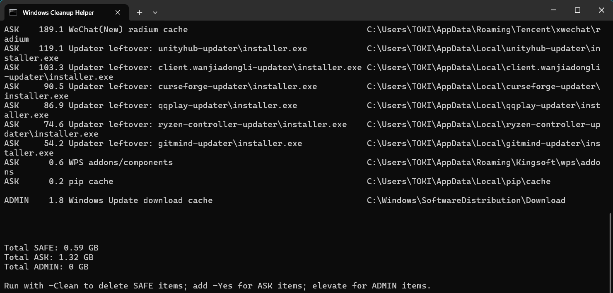
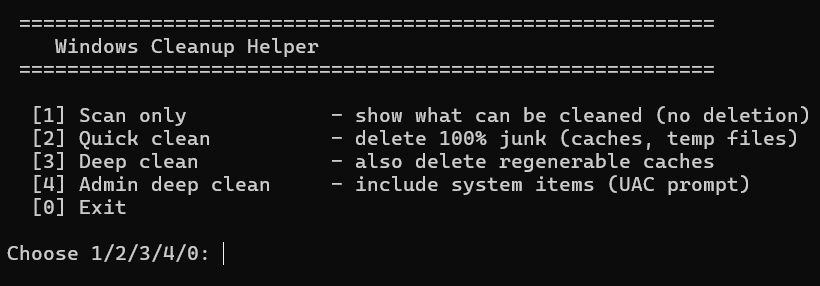
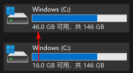

# Windows 清理助手

> **语言：** English ([English README](README.md)) | 简体中文

一个安全、通用的 PowerShell 脚本：扫描并清理 Windows 常见垃圾与缓存，包括
浏览器缓存、临时文件、崩溃转储、缩略图缓存、包管理器缓存、更新器残留、
旧版启动器版本、系统缓存等。



若不便于手动输入命令，可直接双击 `一键清理.bat`（将其与 windows-cleanup.ps1 置于同一目录）：

* [1] 只扫描 - 查看可清理内容，不删除任何文件
* [2] 快速清理 - 删除 100% 垃圾（SAFE 项）
* [3] 深度清理 - 额外删除可再生的缓存（SAFE + ASK 项）
* [4] 管理员深度清理 - 包含系统级项目（会弹出 UAC 确认）
* [0] 退出




所有可清理项目分为三类：

| 类别 | 含义 | 删除方式 |
| --- | --- | --- |
| SAFE | 100% 无用、可自动再生的内容 | `-Clean` |
| ASK | 可再生的但可能有用的内容 | `-Clean -Yes` |
| ADMIN | 系统级，需要管理员权限 | 管理员环境下 `-Clean -Yes` |

默认仅执行扫描，不删除任何文件。**在添加 `-Clean` 参数之前，不会删除任何内容。**

## 使用方法

```powershell
# 仅报告可清理内容（不做任何修改）
powershell -ExecutionPolicy Bypass -File windows-cleanup.ps1 -Scan

# 删除 SAFE 项（浏览器缓存、临时文件、崩溃转储、缩略图等）
powershell -ExecutionPolicy Bypass -File windows-cleanup.ps1 -Clean

# 同时删除 ASK 项（包缓存、更新器残留、回收站等）
powershell -ExecutionPolicy Bypass -File windows-cleanup.ps1 -Clean -Yes
```

系统级（ADMIN）项目需要在管理员 PowerShell 中运行：
右键点击"Windows PowerShell"或"终端"图标 → 选择"以管理员身份运行"，
然后再执行上面的命令。

## 清理内容

* SAFE：用户临时文件、浏览器缓存（Edge / Chrome / Brave / Firefox）、
  崩溃转储、缩略图缓存、WebCache、MATLAB ServiceHost 旧版本。
* ASK：uv / npm / pip / Unity 缓存、游戏 scratch 缓存、腾讯系应用缓存
  （微信小程序运行时）、WPS 插件组件、更新器残留安装包、
  旧版启动器版本、回收站。
* ADMIN：Windows 临时文件、Windows 更新下载缓存、Visual Studio 安装包缓存、
  系统 Package Cache、Logitech G HUB 缓存、天美游戏更新包残留。

## 说明

* 支持 Windows 10 / 11，兼容 Windows PowerShell 5.1 和 PowerShell 7+。
* 仅使用环境变量，未对用户名进行硬编码，可适配任意用户环境。
* 删除的文件不会进入回收站（回收站本身的清空除外）。
* 被程序占用的文件将自动跳过并给出提示；关闭相应程序后重新运行即可。
* conda 包缓存建议使用 `conda clean --all` 清理，不要直接删除目录。
* 删除系统 Package Cache / VS 安装包缓存后，部分程序在修复或卸载时需要
  重新下载安装器。

## 许可证

本项目基于 [MIT 许可证](LICENSE) 发布。
